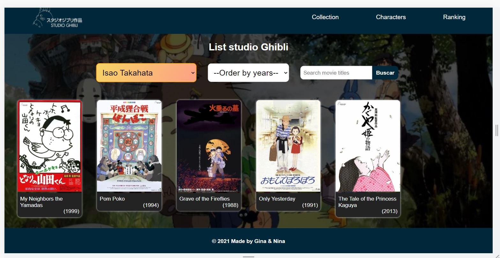
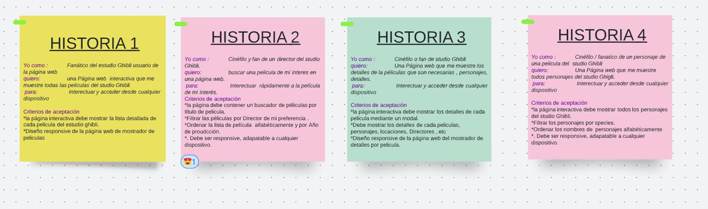

# PROYECTO DATA DEL STUDIO GHIBLI 

Este PROYECTO es una página web  interactiva que va dirigido a cinefilos y faánitcos del ánime que desean visualizar detalles  de sus peliculas favoritas del estudio Ghibli , que es el estudio japonés de animación, considerado por la crítica especializada y muchos cinéfilos como uno de los mejores estudios de animación del mundo en la actualidad.

Toda esta información puede ser manejada por los usuarios, de tal manera que puedan filtrarla y ordenarla según diversas especificaciones.

## Contenido

* [1. detalles  de la página web](#1-detalles-de-la-página-web)

* [2. Historias de usuario](#2-historias-de-usuario)

* [3. Prototipo de alta fidelidad](#3-prototipo-de-alta-fidelidad)

* [4. Plan de acción](#4-plan-de-acción)

* [5. Objetivos de aprendizaje](#5-objetivos-de-aprendizaje)

***

## 1. detalles  de la página web

visita nuestra página en este enlace  [data Gibli pages ](https://ninoska2000.github.io/LIM015-data-lovers-nat/src/) del proyecto.

la página Web elaborada consta de secciones de header, donde se muestra las opciones de tres páginas ,de tal manera que el usuario puede visualizar las colecciones del estudio GHibli mediante la opción de Collection , con la opción de characteres puede visualizar todo los personajes del estudio Ghibli y la última opción de Rankings, Puedes visualizar los Rankings de peliculas mas taquilleras del estudio Ghibli .

las páginas Collection y charecters cuenta dentro de ella con opciones de filtrado, ordenado y/o búsqueda de tal manera que pueda facilitar al usuario su facil navegación .

## 2. Historias de usuario

Una historia de usuario es una explicación general e informal de una función de software escrita desde la perspectiva del usuario final. Su propósito es articular cómo proporcionará una función de software valor al cliente.

En este proyecto abordamos 4 Historias de usuarios:

## 3. Prototipo de alta fidelidad

👉 Aqui te presentamos el prototipo de Figma del proyecto  [Figma](https://www.figma.com/file/PN8jlkOYqR1WgQxhK68JBv/EstudioGibli) del proyecto.

## 4. Plan de acción
1. Conocer al usuario
2. Armar las historias de usuario y criterios de aceptación 
3. Elaborar prototipo de alta fidelidad en Figma 
4. Feedback de usuarios para mejorar prototipo
5. Mejorar el prototipo
6. Implementar la interfaz (html/css/js)
7. Pantalla de inicio (header con botón y sección de Hayao)
8. Sección de películas: Mostrar los posters en divs
9. Sección de películas: Colocar div flotante donde se muestra título, descripción, etc
10. Sección de películas: Ordenar data según especificaciones:
    - Por score 
    - Por year of release
    - Latest animations
    - De la A a la Z
    - De la Z a la A
      - Testing de sort 
11. Sección de películas: Filtrar data según especificaciones
    - Top 5
    - Directed by Hayao
    - Directed by Isao
    - Produced by Toshio
      - Testing de filtrado

Agregar las secciones 
* Sección de personajes: Mostrar los personajes en divs.
* Sección de personajes: Calcular cantidad de personajes.
* Sección de locaciones: Mostrar los personajes en divs.
* Sección de Vehiculos: Mostrar los personajes en divs.

 

